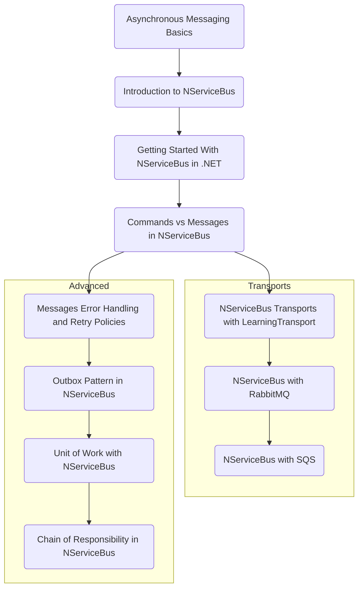

<!-- ---
title: Content Ideas For Future Blog Articles
date: "2023-08-01T00:00:00.000Z"
description: "Ideas, sketches, and drafts for future blog articles."
image: "/ideas.png"
--- -->

# Blog Post Series Outline

* 1 Asynchronous Messaging Basics
* 2 Introduction to NServiceBus
* 3 Getting Started With NServiceBus in .NET
* 4 Commands vs Messages in NServiceBus
* Transports
* * 5a NServiceBus Transports with LearningTransport
* * 5b NServiceBus with RabbitMQ
* * 5c NServiceBus with SQS
* Advanced NServiceBus
* * 6a - Messages Error Handling and Retry Policies
* * 6b - Outbox Pattern in NServiceBus
* * 6c - Unit of Work with NServiceBus
* * 6d - Chain of Responsibility in NServiceBus