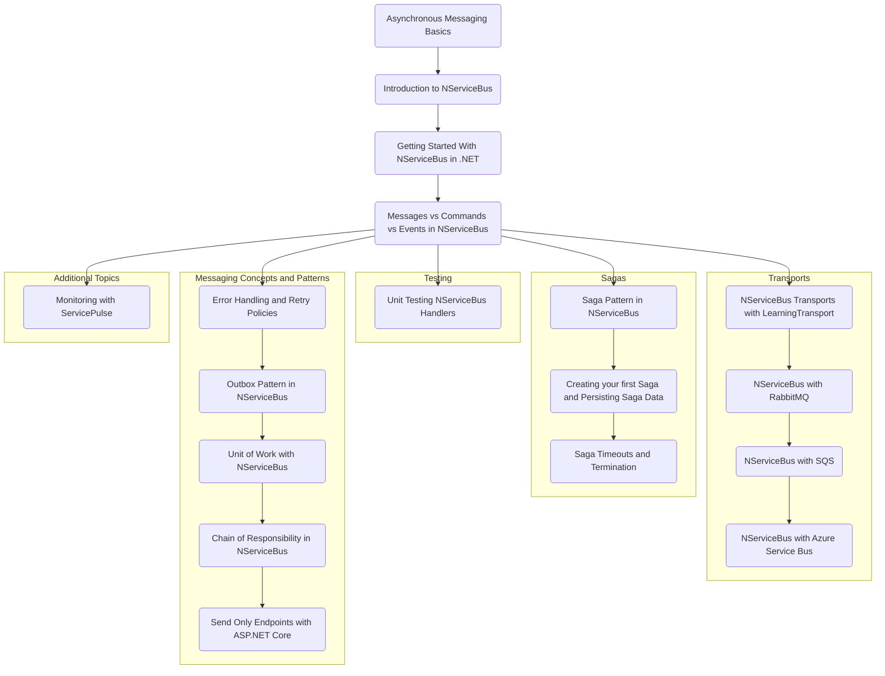

<!-- ---
title: Content Ideas For Future Blog Articles
date: "2023-08-01T00:00:00.000Z"
description: "Ideas, sketches, and drafts for future blog articles."
image: "/ideas.png"
--- -->

# Asynchronous Messaging with NServiceBus Blog Post Series Outline

## Series Outline

* 1 Asynchronous Messaging Basics (optional series introduction)
* 2 Introduction to NServiceBus 
* 3 Getting Started With NServiceBus in .NET
* 4 Messages vs Commands vs Events in NServiceBus
* Transports
* * 5a NServiceBus Transports with LearningTransport
* * 5b NServiceBus with RabbitMQ
* * 5c NServiceBus with SQS
* * 5d NServiceBus with Azure Service Bus (or Storage Queues)
* Messaging Concepts and Patterns
* * 6a - Error Handling, Retry Policies, and Recoverability
* * 6b - Outbox Pattern in NServiceBus
* * 6c - Unit of Work with NServiceBus
* * 6d - Chain of Responsibility in NServiceBus
* * 6e - Send Only Endpoints with ASP.NET Core
* Sagas
* * 7a - Saga Pattern in NServiceBus
* * 7b - Creating your first Saga and Persisting Saga Data
* * 7c - Saga Timeouts and Termination
* Testing
* * 8a Unit Testing NServiceBus Handlers
* Additional Topics
* * 9a - Monitoring with ServicePulse

## Notes

I'm open to feedback, revisions, and other topics as needed. The goal is to have a series that demonstrates our competency in NServiceBus to potential clients as well as being a definitive guide for developers looking to get started with NServiceBus and support them as they advance through common patterns and gotchas. Similar to this series by Andrew Lock on Kubernetes for .NET. https://andrewlock.net/deploying-asp-net-core-applications-to-kubernetes-part-1-an-introduction-to-kubernetes/

Also, I couldn't get the mermaid diagram to order the subgraphs in a friendly manner but that is meant for my planning more than actual publishing in its current state.