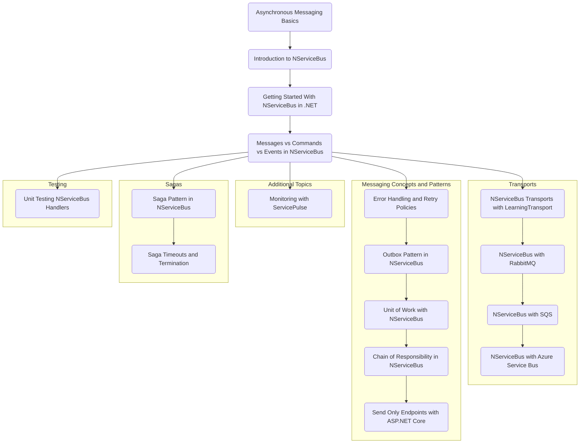

<!-- ---
title: Content Ideas For Future Blog Articles
date: "2023-08-01T00:00:00.000Z"
description: "Ideas, sketches, and drafts for future blog articles."
image: "/ideas.png"
--- -->

# Asynchronous Messaging with NServiceBus Blog Post Series Outline

* 1 Asynchronous Messaging Basics (optional series introduction)
* 2 Introduction to NServiceBus 
* 3 Getting Started With NServiceBus in .NET
* 4 Messages vs Commands vs Events in NServiceBus
* Transports
* * 5a NServiceBus Transports with LearningTransport
* * 5b NServiceBus with RabbitMQ
* * 5c NServiceBus with SQS
* * 5d NServiceBus with Azure Service Bus (or Storage Queues)
* Messaging Concepts and Patterns
* * 6a - Error Handling, Retry Policies, and Recoverability
* * 6b - Outbox Pattern in NServiceBus
* * 6c - Unit of Work with NServiceBus
* * 6d - Chain of Responsibility in NServiceBus
* * 6e - Send Only Endpoints with ASP.NET Core
* Sagas
* * 7a - Saga Pattern in NServiceBus
* * 7b - Saga Timeouts and Termination
* Testing
* * 8a Unit Testing NServiceBus Handlers
* Additional Topics
* * 9a - Monitoring with ServicePulse